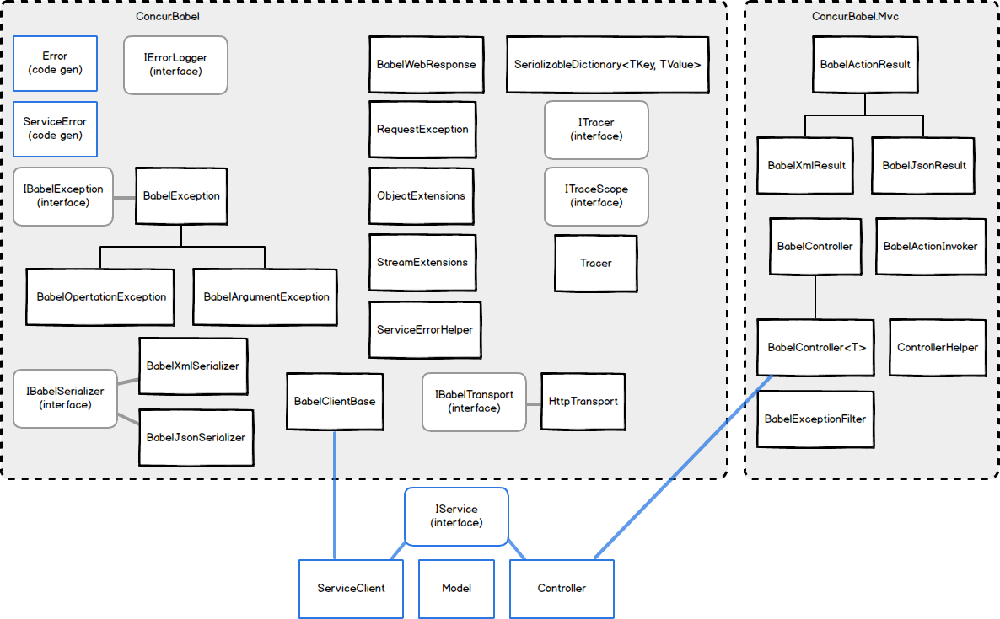

BABEL and C#
============

C# Additional Options
---------------------

The -options command-line switch allows you to specify the following values:

<table><thead><tr><th>Option</th><th>Examples</th><th>Description</th></tr></thead>
<tbody>
<tr><td>controller</td><td><code>-option controller=MyOwn.Mvc.BabelController</code></td><td>Allows you to specify which base controller class to use.</td></tr>
<tr>
	<td>output</td>
	<td><code>-option output=ns-flat </code> <code>-option output=ns-nested</code></td>
	<td>
		Allows you to specify output directory options.  Supported options are:  
		ns-flat - code is generated into a flat directory structure corresponding to the namespace. 
		ns-nested - code is generated into a nested directory structure corresponding to the namespace.
	</td>
</tr>
</tbody>
</table>

Model Code
----------
Babel C# model generation is pretty straight forward. 

- Babel struct produces a C# public class
- All value types (int, flat, etc.) properties generated as nullable (int?, float?), excluding enums 
- Maps translated to SerializableDictionary
- Identical models are generated for a service and a client   

**Model Generation for Service and Client Considerations**

We encourage you to generate models separately for your Babel web service and a client. These are generated files, so it's OK to generate them to 2 destinations from one central .babel file. This generation can be made a pre-build step of your project. 

**Code Organization Considerations**

The initial set of projects using babel created folder structures mimicking a traditional MVC app with structures like
App_Code
	/Area1
		/Controllers
		/Models
	/Area2
		/Controllers
		/Models
	
As we became more familiar with babel we're now considering a structure more like
App_Code
	/Generated		<--would contain all generated models for the entire tier
	/Code			<--would contain non generated code
	Area1Controller
	Area1ControllerImpl
	Area2Controller
	Area2ControllerImple

There is not a reference project using the new structures yet, but it's important to realize that the structure for your project when using generated code may differ considerably from when you were not using any code gen.  You may wish to make your project structure very flat so that it becomes very easy to add new babel files into your repository without having to adjust your babel gen scripts at all, so that you can just add a new file, run your gen	script, and be on to coding.  	
		
Server Side Implementation
-------------------------
Babel generates two service specific files containing one - I[ServiceName] interface, and another - [ServiceName]Controller class.

The generated interface file is a direct translation of the service definition from a babel file. A service developer is supposed to write a "business logic" class implementing this interface.
 
The second file is the generated *partial* controller class. A service developer needs to create another "part" of this controller class in a separate file containing
 
	protected override I[ServiceName] InitBusinessLogic()
 
method override. This method is supposed to return an instance of the "business logic" class. All the "business logic" instance  initialization (setting information from the headers, additional request fields, etc.) should be done here.
 
Please note that C# allows you to specify inheritance and attributes only on one part of partial class.This way you can apply your attributes and implement  interfaces without touching an autogenerated part of the class.    
     
*Note on the use of MVC Contoller vs WebAPI*: it was decided to not spend any time on implementing WebAPI support due to the unnecessary problems with the routing including forcing HTTP verbs on methods with the names starting with any HTTP verb and polymorphic behavior.

Client
---------
A complete C# client is generated by Babel. It contains synchronous and asynchronous sets of methods. The generated  client code is thread safe. Here are the examples of calling them: 

	var proxy = new ABCServiceClient("http://url/ABCService", timeout);
	var resultSync = proxy.Foo(parameter1, parameter2);

	var task = proxy.FooAsync(parameter1, parameter2);
	...
	var resAsync = task.Result;
	
It is also a common pattern for Babel service side developers to provide helper factory functions for the client objects.  Here is a simple example which isolates the user of the client library from having to know the url of the service.  

	public ABCServiceClient GetABCServiceClient()
	{
		ABCServiceClient proxy = new ABCServiceClient(Settings.Get("ABCMidtierUrl"), 30);
		return client;
	}
	
Developers may wish to provide even more extensive client bundling functions in their helper libraries especially if the services take complex objects.  This can shield consumers of the service from having to understand the request objects going to the service and present simple primitives as arguments when the service actually takes more coarse grained objects as input.  

	public ResultResponse ABCEvalCommand(string sql, int companyId)
	{
		//validation
		ValidateSqlAndCompany(sql, companyId);
		ShardIdentifier si = GetPopulatedShardInfo(companyId, string.Empty, string.Empty);
		return ABCEvalCommand(sql, si);
	}

	public ResultResponse ABCEvalCommand(string sql, ABCIdentifier abci)
	{
		//validation
		if (String.IsNullOrEmpty(sql))
		{
			throw new ArgumentException("Not provided", "sql");
		}
		ABCServiceClient proxy = GetABCServiceClient();
		Context ctx = GetPopulatedContext();
		ABCRequest req = GetPopulatedABCRequest(ctx, abci, sql);
		ResultResponse results = proxy.ExecUpdate(req);
		return results;
	}

Client Side Logging, Metrics and Troubleshooting
-------------------
The client libraries expose **OnStart**, **OnComplete** and **OnFailute** events. The information passed to these handlers contain method name, full endpoint address, serialized request and response data, headers, timing and error information.
Here is a simple logging implementation:

	var client = new ABCServiceClient(Settings.Get("ABCMidtierUrl"), 30);	

	client.OnStart += (d)=>
	{
		Console.WriteLine("Sending request for method {0} (Full URL: {1}) {2}", d.Url, d.Method, d.Stage);
		Console.WriteLine("Request headers {0} (ms)", d.RequestHeaders);
	};

	client.OnComplete += (d) => {
		Console.WriteLine("Sending request for method {0} (Full URL: {1}) {2}", d.Url, d.Method, d.Stage);
		Console.WriteLine("Request: {0}", Encoding.UTF8.GetString(d.Request));
		Console.WriteLine("Response: {0}" + Encoding.UTF8.GetString(d.Response));
		Console.WriteLine("Request duration: {0} ms", d.DurationMilliseconds);
		string requestHeadersString = string.Join("\r\n", d.RequestHeaders.AllKeys.Select(k => { return k + ":" + d.RequestHeaders[k]; }).ToArray());
		Console.WriteLine("Request headers: {0}", requestHeadersString);
		string responseHeadersString = string.Join("\r\n", d.ResponseHeaders.AllKeys.Select(k => { return k + ":" + d.ResponseHeaders[k]; }).ToArray());
		Console.WriteLine("Response headers: {0}", responseHeadersString);
	};

	client.OnFailure += (d)=>
	{
		Console.WriteLine("Sending request for method {0} (Full URL: {1}) {2}", d.Url, d.Method, d.Stage);
		Console.WriteLine("Request: {0}", Encoding.UTF8.GetString(d.Request));
		Console.WriteLine("Response: {0}" + Encoding.UTF8.GetString(d.Response));
		Console.WriteLine("Request duration: {0} (ms)", d.DurationMilliseconds);
		string requestHeadersString = string.Join("\r\n", d.RequestHeaders.AllKeys.Select(k => { return k + ":" + d.RequestHeaders[k]; }).ToArray());
		Console.WriteLine("Request headers: {0}", requestHeadersString);
		string responseHeadersString = string.Join("\r\n", d.ResponseHeaders.AllKeys.Select(k => { return k + ":" + d.ResponseHeaders[k]; }).ToArray());
		Console.WriteLine("Response headers: {0}", responseHeadersString);
		Console.WriteLine("Transport specific error code: {0}", d.Status);
	};
	
**Notes**

- A single event handler can be used to handle more than one event. In this case the ResponseHandlerData.State property can be used to determine which kind of event is triggered. 

- Not all the IResponseHandlerData properties are available on every request stage. The example above shows all the properties available during an event.     

  		
Test Harness
------------
When you add a test harness to a new project, you need to add a static content type mapping in web.config for an mvc app in order for the test harness to work.  

C# Runtime Library
------------------

Babel Error Handling
---------------------

By default Babel services have a standard error handling implementation. It may be overridden, but it is not advised. In case if an error will be generated by a service the Babel MVC framework will return a protocol specific error code and a ServiceError object data.

The default Babel protocol is HTTP which will returns following HTTP status codes:

<table><thead><tr><th>HTTP Status</th><th>Condition when returned</th></tr></thead>
<tbody>
<tr><td>200</td><td>No error</td></tr>
<tr><td>400</td><td>Error in the request data, for example validation issues</td></tr>
<tr><td>500</td><td>Internal service error, for example database timeout</td></tr>
</tbody></table>     

`ServiceError` data is a standard way to return information about the error condition for a Babel service, it may contain following information:

-   `Time` – date and time when error happened. We encourage to use UTC time
-   `Tags` – optional strings to help categorizing the error   
-   `Context` - optional additional error details (user identifier, request identifier, etc)
-   `Details` – human readable errors details/message in English
-   `Inner` – optional nested server error. Useful to represent InnerException chain.
-   `Errors` – one or more detailed error condition descriptions. Most of the exceptions will have a single Error object in this list. Validation error is a good example of `ServiceError` when multiple Error objects are useful.     
    -   `Code`\* – error code identifying error situation (e.g. VALIADATION\_ERROR)
    -   `Params`\* –provide error condition specifics (e.g. name of the fields that didn’t pass the validation)
    -   `Message` – human readable error message. One can use format strings with {0}…{n} placeholders that will be replaces with Params in the result error message sent to a client

  		\* - combination of `Code` and `Params` can be used by a client to create localized error message

**These are error handling related classes defined in the Babel .Net library:**
 
`IBabelException` - interface that supports Context, list of `Error`s and error kind (currently `Unknown` or `InvalidRequest`). This interface is used for the translation of exceptions to `ServiceError`.

`BabelException` - is a simplest `Exception` implementing the `IBabelException` interface. If thrown will result in the Unknown error kind. This error kind supposed to be used for the error that happened on the service side, with valid request data (e.g. timeout). Used internally by Babel client.

`BabelApplicationException` - inherited from `BabelException`. The only difference is it will result in invalid request error kind. This error kind is used for validation errors, bad request and may be used for something like "record not found" kind of errors. 

`BabelValidionException` - inherited from `BabelApplicationException` and used to report validation errors, including ones detected during a manual/custom validation.      

`ServiceApplicationException` - inherited from `BabelApplicationException`. Provides more convenient syntax to throw exceptions from the Babel services.

Converting Exception to ServiceError
-------------------------------------
The goal of this step is to translate all unhandled exceptions to unified Babel `ServiceError` response model.
As bare minimum `Time`, `Details` and at least one `Error` should be populated.   
A service developer can translate an exception to a `ServiceError` by:

1. Using `ServiceApplicationException` or `BabelException`. Please see the `DemoCreditCardServiceImpl.Save` method in the BabelRpc.TestMvcService\CreditCardDemoServiceImpl.cs for an example. 
-   Creating exception that implements `IBabelException` interface. Check the `BabelException` implementation for an example.  
-   Mapping existing exception types by overriding `TranslateError(…)` method in the controller class. Please see the `DemoCreditCardServiceController.TranslateError` method in the BabelRpc.TestMvcService\CreditCardDemoServiceImpl.cs for an example of implementation

The TranslateError (#3) has advantage of writing a service logic implementation that is decoupled from Babel, so developers don't need to use special Babel  exception types. All error reporting logic will be easier to maintain as it will not be distributed across entire application.

*Note:* this has nothing to do with localization/internationalization. In general service should return error message in some well known language that most of the developers can understand (e.g. English) and a service client can translate it to user language using error code and parameters.     

Babel Error Codes
-----------------
It is up to a service developer to define service specific error codes. Few codes are used by the Babel framework

-   `INVALID_JSON` – request type is JSON and request cannot be deserialized
-   `INVALID_XML`– request type is XML and request cannot be deserialized
-   `VALIDATION_ERROR` – error thrown by a validation routine
-   `INVALID_REQUEST` – other problem with received request. This code is automatically set for `ArgumentException` , `ApplicationException` or `NotImplementedException`
-   `INTERNAL_ERROR` – other unhandled exceptions not implementing `IBabelException`

Validation in Babel
-------------------
Babel controller or model doesn’t validate data received, but there is an easy way to do it: `IBabelModel` implemented by all models generated by Babel in .Net has `Validate` extension methods defined in `BabelRpc.BabelModelExtensions` class. There are two methods for validation:

 This will throw `BabelValidionException` on validation error:

	modelData.Validate();

This will return Boolean (false on validation error\[s\]):

    List<ValidationResult> errors;
    if (!modelData.Validate(out errors))
    {
    //process validation errors
    }

This validation uses the standard `System.ComponentModel.DataAnnotations` validation attributes (<https://msdn.microsoft.com/en-us/library/system.componentmodel.dataannotations%28v=vs.110%29.aspx>)

Please note that MS validator doesn’t perform deep validation – it validates only top level object. `BabelRpc.BabelModelExtensions.Validate(...)` validates the entire object hierarchy.

The validation attributes can be added to .babel model by using scoped attributes:
 
	@cs[System.ComponentModel.DataAnnotations.Range(1980, 2100)]
	int16 ExpirationYear;

Other Useful Babel Model Extensions
-----------------------------------

`BabelRpc.BabelModelExtensions` also provides following useful `IBabelModel` extensions:

Model comparison:

-   `bool Compare(this IBabelModel obj, IBabelModel value)`
-   `bool Compare(this IBabelModel obj, IBabelModel value, out string path)` - outputs the first found model member that is different

Deep copy of the model – clones the entire model hierarchy

-   `IBabelModel DeepCopy(this IBabelModel obj)`

Please note that `BabelRpc.BabelModelExtensions` doesn’t use reflections, leveraging `IBabelModel` `RunOnChildren` and `RunOnChild` methods instead.
